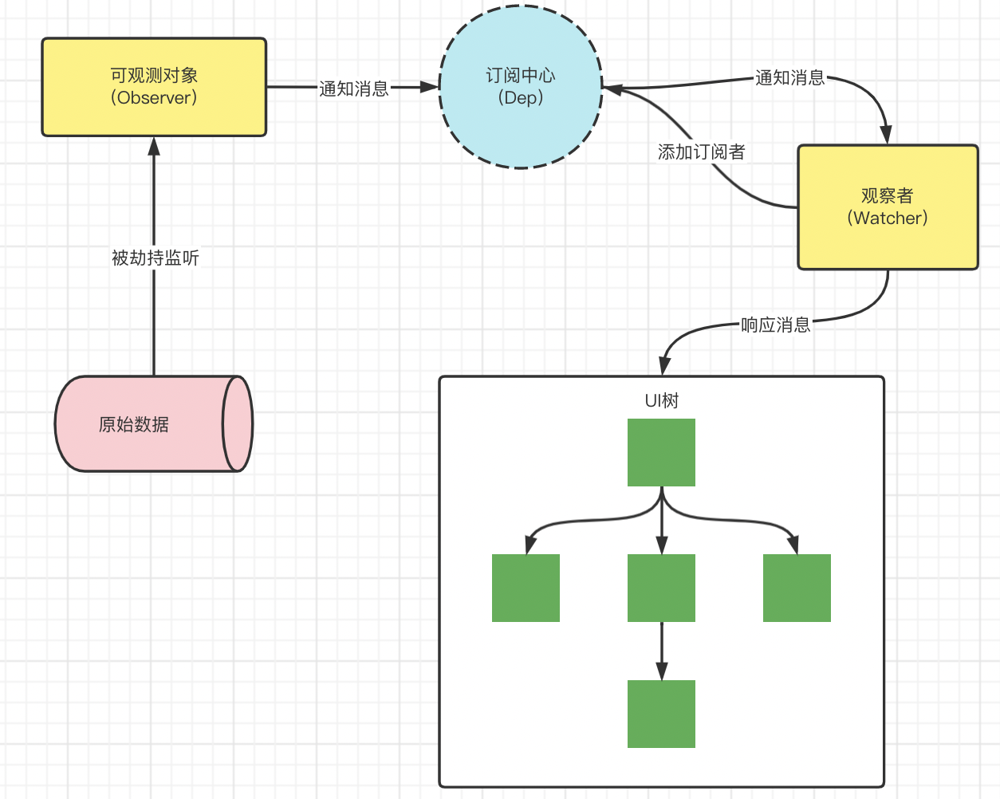
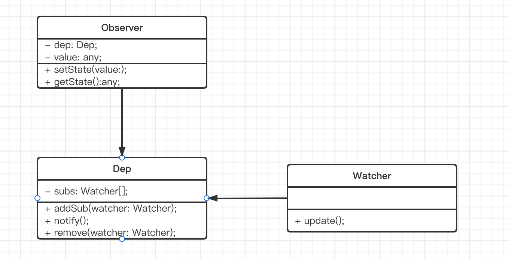

## Vue原理全图（一）：响应式

Vue中常常被提及的一个词：**响应式！**这是Vue的核心内容，Vue的UI响应变化、计算属性、观察等能力都是基于它实现。

它的核心理念就是订阅/发布模式；下面先简单介绍订阅发布模式。


## 发布/订阅模式\<Reactive\>

#### Vue中的作用




原始数据被代理为被观察者，订阅中心收集对应的被观察对象的观察者，当被观察对象数据发生变化的时，订阅中心将会通知观察者来做出相应的动作\<如：视图的更新、数据的更新、动作的触发等>

#### 订阅发布类图



#### 订阅发布实现响应式UI

[代码详见](https://github.com/swdenglian/vue-principle/tree/reactive-normal)

```tsx
/**
 * @file 普通响应式数据渲染 hello world
 */
import { Dep } from "./pattern/Dep";
import { Observer } from "./pattern/Observer";
import { Watcher } from "./pattern/Watcher";
import { Render } from "./render";

// 这里的 Render 就是模拟 UI 树
const renderer = new Render(
  document.getElementById("app")!,
  (value: string) => `<div>${value}</div>`
);

const watcher = new Watcher((value: string) => {
  renderer.update(value);
});

const dep = new Dep<string>();
dep.addSub(watcher); // 手动添加依赖，在Vue中，依赖是由Vue自动收集的。下面会讲到

const observer = new Observer<string>("nothing", dep); // 创建一个被观察的对象，修改值的时候会触发 dep 发出通知

setTimeout(() => {
  /**
   * 模拟延迟修改数据
   */
  observer.setState("hello world"); // 在Vue中这里是使用 get/set 劫持了了数据，所以无需显示的调用setState，而是直接赋值
}, 3000);
```


#### 自动收集依赖类图

#### 自动收集依赖实现响应式UI

### 总结

