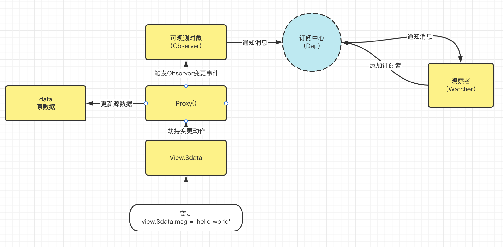

## Vue原理全图（一）：响应式

Vue中常常被提及的一个词：**响应式！**这是Vue的核心内容，Vue的UI响应变化、计算属性、观察等能力都是基于它实现。

它的核心理念就是订阅/发布模式；下面先简单介绍订阅发布模式。


## 发布/订阅模式\<Reactive\>

#### Vue中的作用


原始数据被代理为被观察者，订阅中心收集对应的被观察对象的观察者，当被观察对象数据发生变化的时，订阅中心将会通知观察者来做出相应的动作\<如：视图的更新、数据的更新、动作的触发等>

#### 订阅发布类图


#### 订阅发布实现响应式UI

[代码详见](https://github.com/swdenglian/vue-principle/tree/reactive-normal)

```tsx
/**
 * @file 普通响应式数据渲染 hello world
 */
import { Dep } from "./pattern/Dep";
import { Observer } from "./pattern/Observer";
import { Watcher } from "./pattern/Watcher";
import { Render } from "./render";

// 这里的 Render 就是模拟 UI 树
const renderer = new Render(
  document.getElementById("app")!,
  (value: string) => `<div>${value}</div>`
);

const watcher = new Watcher((value: string) => {
  renderer.update(value);
});

const dep = new Dep<string>();
dep.addSub(watcher); // 手动添加依赖，在Vue中，依赖是由Vue自动收集的。下面会讲到

const observer = new Observer<string>("nothing", dep); // 创建一个被观察的对象，修改值的时候会触发 dep 发出通知

setTimeout(() => {
  /**
   * 模拟延迟修改数据
   */
  observer.setState("hello world"); // 在Vue中这里是使用 get/set 劫持了了数据，所以无需显示的调用setState，而是直接赋值
}, 3000);
```

上述的使用方式太繁琐了是吧？其实是由两个原因导致：

- 太松散了，这个过程是否可以封装一下，只需要输入数据，render即可。

- setState 显示调用数据变更，看起来不太智能。

下面将介绍如何解决上面这2个问题。

#### 对模式的封装：数据劫持

##### 原理图



如上图：可以实现一个View类，内部封装了订阅发布的过程。劫持了源数据，对外爆露出$data属性，访问和修改源数据均通过$data操作，当访问属性时候直接将源数据抛出，修改源数据的时候触发订阅发布的Observer，后触发订阅发布流程更新视图。

##### 代码展示

[代码详见](https://github.com/swdenglian/vue-principle/tree/reactive-proxy-data)

```tsx
/**
 * @file 普通响应式数据渲染 hello world
 */
import { View } from "./View";

const view = new View({
  data: {
    msg: "yooo",
  },
  render: (data) => `<div>${data.msg}</div>`,
  mount: document.getElementById("app")!,
});

setTimeout(() => {
  /**
   * 模拟延迟修改数据
   */
  view.$data.msg = "hello world, yooo";
}, 3000);
```

这里是否看起来已经有点 Vue 的味道了呢~~~

下面展示 ./view 源码，其中封装了订阅发布的流程、数据劫持能力

```tsx
/**
 * @file 封装订阅发布、劫持数据访问
 */
import { Dep } from "./pattern/Dep";
import { Observer } from "./pattern/Observer";
import { Watcher } from "./pattern/Watcher";
import { Render } from "./render";

interface Options<T> {
  data: T;
  render: (data: T) => string;
  mount: HTMLElement;
}

export class View<T extends Object> {
  public $data: T;

  private data: T;
  private renderer: Render<T>;
  private watcher = new Watcher<T>((data) => {
    this.renderer.update(data);
  });
  private dep = new Dep<T>();
  private observer: Observer<T>;

  public constructor(options: Options<T>) {
    const { data, render, mount } = options;

    this.data = data;

    // 装配订阅发布流程
    this.renderer = new Render(mount, render);
    this.dep.addSub(this.watcher);
    this.observer = new Observer({ ...this.data }, this.dep);

    // 代理源数据
    this.$data = this.initData();
  }

  public initData() {
    return new Proxy(this.data, {
      get(target, prop, reciver) {
        return Reflect.get(target, prop, reciver);
      },
      set: (target, prop, value, reciver) => {
        this.observer.setState({
          ...this.observer.getState(),
          [prop]: value,
        });

        return Reflect.set(target, prop, value, reciver);
      },
    });
  }
}
```


### 总结

